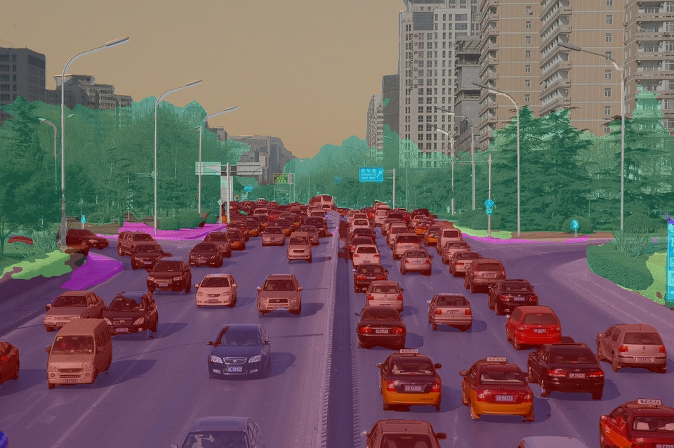

## Preparing to Run

Install python dependencies:
```bash
pip3 install -r requirements.txt
``` 

```bash
omz_downloader --name ocrnet-hrnet-w48-paddle
cd public/ocrnet-hrnet-w48-paddle
python3 export.py --config configs/ocrnet/ocrnet_hrnetw48_cityscapes_1024x512_160k.yml --model_path ./model.pdparams
mkdir -p ../../model/1
mv output/model.pdiparams ../../model/1/model.pdiparams
mv output/model.pdmodel ../../model/1/model.pdmodel
cd ../../
```
## Deploying OVMS

Deploy OVMS with vehicles analysis pipeline using the following command:

```bash
docker run -p 9000:9000 -d -v ${PWD}/model:/models openvino/model_server --port 9000 --model_path /models --model_name ocrnet
```
## Requesting the Service

Now you can run the client:
```bash
python3 segmentation.py --grpc_port 9000 --image_input_path ../common/python/cars/road1.jpg --image_output_path ./road2.jpg
```
Examplary result of running the demo:

